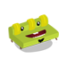
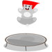
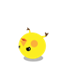
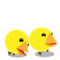

# pico-safari

Pico Safari - an augmented reality game for collecting little digital creatures in the real world. This is old code - late 2009 to early 2010 - for the server end of the project and assets. It was written in PHP to work with [Layar](https://www.layar.com), a student collaboration with Lucio Gutierrez, Garry Wong, and Calen Henry.

I presented on the project in 2011 at the Society for Digital Humanities annual meeting. My notes are posted if you'd [like to learn more](https://sense.porganized.com/pico-safari-active-gaming-in-integrated-environments-118a72f71d6a), and the code here was last tweaked for that talk. After Pico Safari, Lucio Gutierrez worked on developing this project into an city exploration app called [fAR-Play](https://hypatia.cs.ualberta.ca/aarg_project/far-play/index.php?page=login.php).

 The code might be long in the tooth, but the character images are still fun. You're welcome to reuse the ones I drew, with a  [CC-BY 4.0 license](https://creativecommons.org/licenses/by/4.0/):

